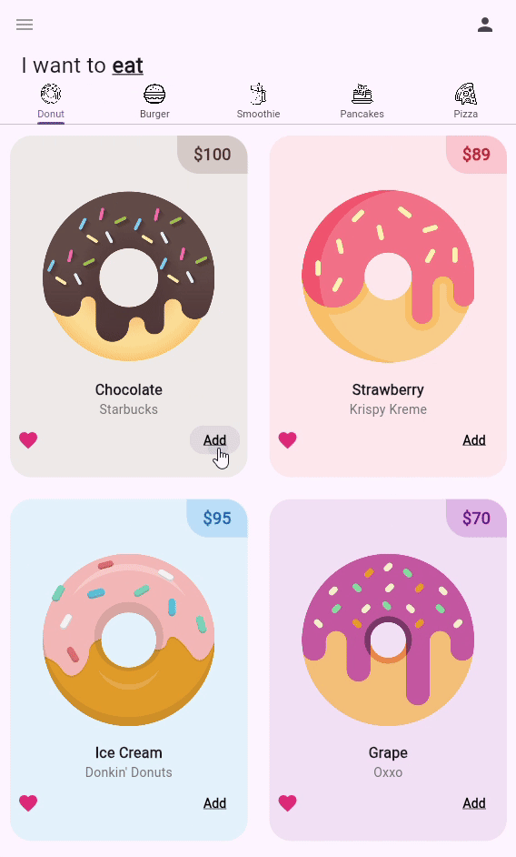

# 🍩 Flutter Donut Shop App 🍩

## 🚀 Project Overview

Welcome to the **Flutter Donut Shop App**! This is a simple mobile application designed to showcase various food items using Flutter widgets, focusing on a pleasant and easy-to-navigate user interface.

## ✨ Key Features

* **Tab-Based Navigation:** Easily switch between different food categories like **Burgers**, **Donuts**, **Pancakes**, **Pizza**, and **Smoothies** using a `TabBar`. 🍔🥞🍕
* **Item Listing View:** Use a `TabBarView` to display a list of items within each category.
* **Custom Item Tiles:** Each food item is presented using a dedicated tile widget for clear and attractive presentation.
* **Responsive Grid Layout:** Implemented **`SliverGridDelegateWithFixedCrossAxisCount`** to efficiently manage the layout and display of items in a grid format, ensuring a great look on different screen sizes.

---

## 🏗️ Core Widgets & Concepts

| Widget / Concept | Description |
| :--- | :--- |
| **`TabBar`** | Used for creating the horizontal navigation bar, allowing users to select different food categories. |
| **`TabBarView`** | Displays the content (the list of items) corresponding to the selected tab. |
| **`SliverGridDelegateWithFixedCrossAxisCount`** | A delegate for creating a grid layout with a fixed number of tiles in the cross-axis (horizontal). Crucial for structuring the item lists. |
| **`Custom Item Tiles`** | Widgets like `donut_tile.dart` used to structure and display the individual food items with their image, name, and price. |

---

## 🛠️ Technologies Used

| Technology | Description |
| :--- | :--- |
| **Flutter** | Open-source UI software development kit for building beautiful, natively compiled applications for mobile, web, and desktop from a single codebase. |
| **Dart** | The programming language used by Flutter. |

---

## 📂 Project Structure (lib)

The core application logic and UI components reside in the `lib` folder.
